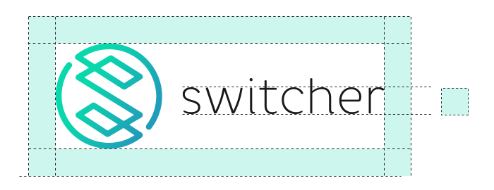
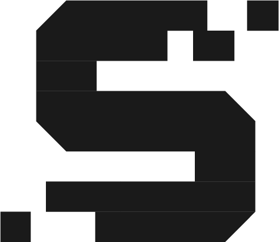
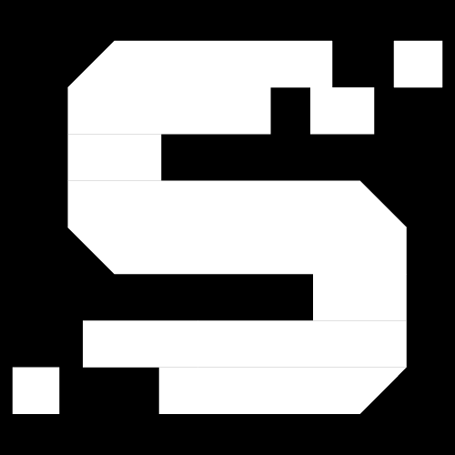
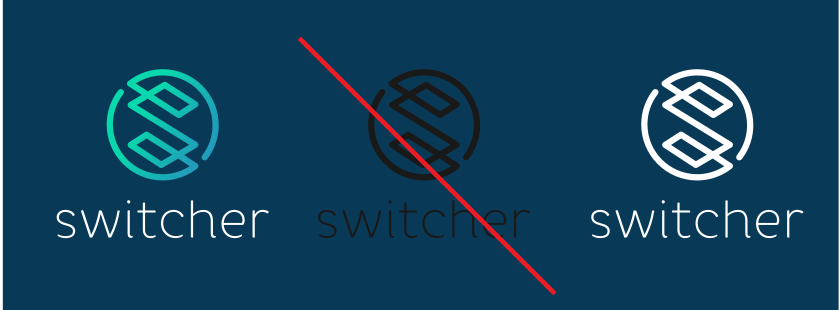
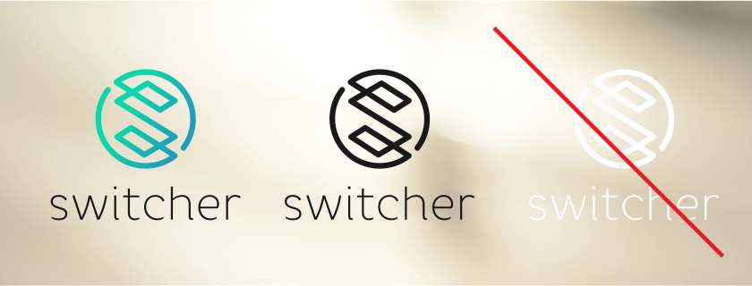

# NORMES GRAPHIQUES 


## LOGOS PRIMAIRE ET SECONDAIRE

#### GRILLE GRAPHIQUE

Voici la grille graphique du logo, avec les proportions à respecter à chaque utilisation du logo. Que ce soit pour apparaître dans une application, sur un site web, sur une entête de lettre, sur une affiche ou dans une série de logos, les proportions doivent TOUJOURS êtres respectées.


#### ESPACE DE PROTECTION

En tout temps, le logo doit être entouré d’une zone dégagée pour être lisible et communiquer efficacement. Aucun texte, aucune ligne, aucun élément typographique, aucune image, photo ou illustration ne doit occuper cet espace.




#### TAILLE MINIMALE

Le logo ne doit jamais être utilisé lorsque l’icône principale est à moins de 0,5 pouces de hauteur.


## CODES COULEURS

#### COULEURS (DÉGRADÉ)


```
C88 M0 Y34 K0
R8 G216 B172
#08d8ac

C87 M8 Y10 K0
R32 G157 B186
#209dba
```
#### NOIR


```
C0 M0 Y0 K90
R26 G26 B26
#1a1a1a
```
#### BLANC


```
C0 M0 Y0 K0
R255 G255 B255
#ffffff
```
## UTILISATIONS GÉNÉRALES

### Fond uni et foncé

Pour maximiser la lisibilité du logo sur un fond uni et foncé, il est conseillé d’utiliser la version couleur ou blanche du logo.

JAMAIS utiliser la version noire.




### Fond uni et clair

Pour maximiser la lisibilité du logo sur un fond uni et clair, uniquement la version couleur ou noire du logo est permise.

JAMAIS utiliser la version blanche.


### Photo très claire

Pour maximiser la lisibilité du logo sur une photo très claire, il est conseillé d’utiliser la version noire du logo. 

JAMAIS utiliser la version blanche.



## Lisibilité maximale

Pour assurer une lisibilité maximale du logo, la règle à respecter est de ne jamais modifier ni altérer aucune partie du logo.
